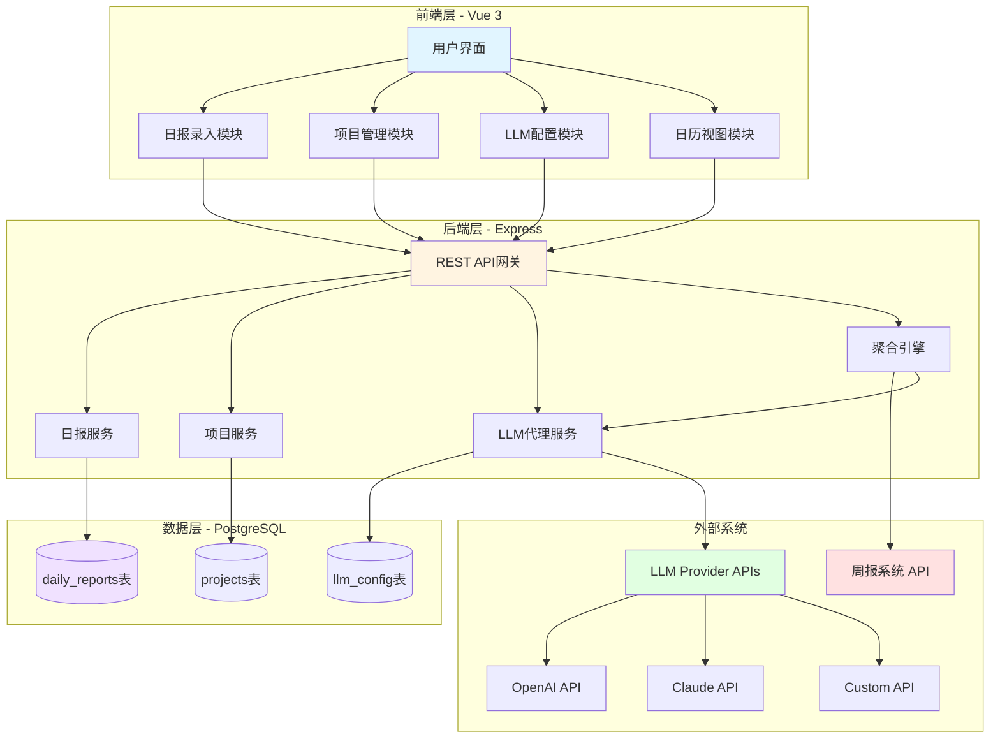
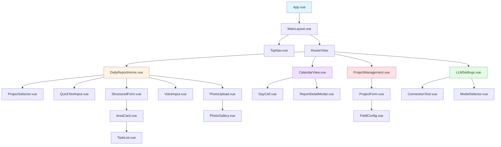
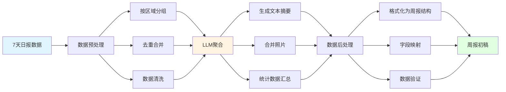
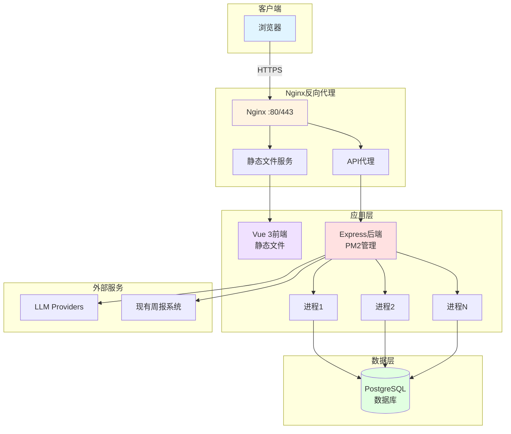

# 设计文档：日报到周报LLM聚合系统

## Overview

日报到周报LLM聚合系统是一个独立的全栈应用，采用三层架构（前端Vue 3 + 后端Express + 数据库PostgreSQL），通过LLM技术自动将7天日报聚合为周报初稿。系统支持多项目管理、多种日报录入模式（快速文本、结构化表单、语音、照片），并与现有周报系统通过REST API集成。

### 核心设计原则

1. **微服务独立性**：日报系统独立部署，通过API与周报系统松耦合
2. **数据隔离**：每个项目的数据完全隔离，支持不同甲方的定制需求
3. **渐进式集成**：Phase 1使用Mock LLM，Phase 2接入真实LLM API
4. **灵活扩展**：支持标准字段+自定义字段，适应不同项目需求

### 技术栈选型

- **前端**：Vue 3 + Vite + TailwindCSS + Pinia + Vue Router
- **后端**：Node.js + Express + Sequelize + Winston
- **数据库**：PostgreSQL 14+
- **LLM集成**：统一接口适配OpenAI/Claude/Custom providers
- **部署**：Nginx (前端) + PM2 (后端) + PostgreSQL

## Architecture

### 系统架构图



### 三层架构详细说明

#### 1. 前端层（Vue 3 + Vite + TailwindCSS）

**职责**：
- 提供用户交互界面
- 管理应用状态（Pinia store）
- 处理表单验证
- 调用后端REST API
- 实现响应式布局

**核心模块**：
- **日报录入模块**：支持4种输入模式（快速文本、结构化表单、语音、照片）
- **项目管理模块**：配置项目信息、标准字段、自定义字段
- **LLM配置模块**：配置LLM供应商、测试连接、选择模型
- **日历视图模块**：显示月度日报填报状态、查看/编辑历史记录

#### 2. 后端层（Node.js + Express）

**职责**：
- 提供RESTful API端点
- 实现业务逻辑
- 数据持久化（Sequelize ORM）
- 与LLM Provider通信
- 与周报系统集成
- 日志记录（Winston）

**核心服务**：
- **日报服务（DailyReportService）**：CRUD操作、数据验证
- **项目服务（ProjectService）**：项目配置管理
- **LLM代理服务（LLMProxyService）**：统一LLM API接口、Mock模式、降级策略
- **聚合引擎（AggregationEngine）**：多日报聚合、数据映射、周报生成

#### 3. 数据层（PostgreSQL）

**职责**：
- 持久化存储
- 数据完整性约束
- 索引优化查询
- 事务支持

## Components and Interfaces

### 前端组件树



### 页面级组件

#### 1. DailyReportHome.vue
**功能**：日报录入主页面  
**状态**：
- `currentProject`: 当前选中的项目
- `inputMode`: 当前输入模式（'quick'|'structured'|'voice'|'photo'）
- `formData`: 表单数据对象

**关键方法**：
- `switchInputMode(mode)`: 切换录入模式
- `submitReport()`: 提交日报
- `saveDraft()`: 保存草稿

#### 2. CalendarView.vue
**功能**：日历视图，显示月度日报填报状态  
**状态**：
- `currentMonth`: 当前显示的月份
- `reportStatus`: 本月日报填报状态Map
- `selectedDate`: 选中的日期
- `selectedReport`: 选中日期的日报数据

**关键方法**：
- `loadMonthReports()`: 加载指定月份的日报
- `onDateClick(date)`: 点击日期
- `editReport(reportId)`: 编辑日报
- `deleteReport(reportId)`: 删除日报
- `copyToToday(reportData)`: 复制到今天

#### 3. ProjectManagement.vue
**功能**：项目配置管理  
**状态**：
- `projects`: 项目列表
- `editingProject`: 当前编辑的项目
- `standardFields`: 可用的标准字段列表
- `customFields`: 自定义字段列表

**关键方法**：
- `createProject()`: 创建新项目
- `updateProject(project)`: 更新项目配置
- `deleteProject(projectId)`: 删除项目
- `addCustomField(field)`: 添加自定义字段

#### 4. LLMSettings.vue
**功能**：LLM供应商配置  
**状态**：
- `provider`: 当前LLM供应商（'openai'|'claude'|'custom'）
- `baseUrl`: API基础URL
- `apiKey`: API密钥（masked）
- `enabledModels`: 已启用的模型列表
- `connectionStatus`: 连接状态

**关键方法**：
- `testConnection()`: 测试LLM连接
- `fetchModels()`: 获取可用模型列表
- `saveConfig()`: 保存LLM配置
- `toggleMockMode()`: 切换Mock模式

### 通用组件

#### ProjectSelector.vue
下拉选择器，切换当前项目  
**Props**: `projects: Project[]`, `modelValue: string`  
**Emits**: `update:modelValue(projectId)`

#### AreaCard.vue
区域卡片，显示区域信息和任务列表  
**Props**: `area: Area`, `editable: boolean`  
**Slots**: `header`, `footer`

#### TaskList.vue
任务列表，支持增删改  
**Props**: `tasks: Task[]`, `editable: boolean`  
**Emits**: `add`, `update`, `delete`

#### PhotoGallery.vue
照片画廊，支持预览、删除  
**Props**: `photos: Photo[]`  
**Emits**: `delete(photoId)`

### 状态管理（Pinia Stores）

#### projectStore
```javascript
{
  currentProject: Project | null,
  projects: Project[],
  loading: boolean,
  
  // Actions
  fetchProjects(),
  selectProject(projectId),
  createProject(project),
  updateProject(project),
  deleteProject(projectId)
}
```

#### reportStore
```javascript
{
  currentReport: DailyReport | null,
  reports: DailyReport[],
  drafts: Map<string, DailyReport>,
  
  // Actions
  fetchReports(projectId, startDate, endDate),
  createReport(report),
  updateReport(reportId, report),
  deleteReport(reportId),
  saveDraft(report),
  loadDraft(date)
}
```

#### llmStore
```javascript
{
  provider: 'openai' | 'claude' | 'custom',
  baseUrl: string,
  apiKey: string,
  enabledModels: string[],
  mockMode: boolean,
  connectionStatus: 'idle' | 'testing' | 'connected' | 'failed',
  
  // Actions
  testConnection(),
  fetchModels(),
  saveConfig(config),
  toggleMockMode()
}
```

## Data Models

### 数据库Schema

#### daily_reports表

```sql
CREATE TABLE daily_reports (
  id UUID PRIMARY KEY DEFAULT gen_random_uuid(),
  project_id UUID NOT NULL REFERENCES projects(id) ON DELETE CASCADE,
  date DATE NOT NULL,
  submitter JSONB NOT NULL, -- {name: string, role: string}
  standard_fields JSONB NOT NULL DEFAULT '{}', -- {areas, tasks, photos, labor_stats, etc.}
  custom_fields JSONB NOT NULL DEFAULT '{}', -- 项目特定字段
  freetext JSONB DEFAULT '{}', -- {summary: string, voice_notes: string}
  created_at TIMESTAMP WITH TIME ZONE DEFAULT CURRENT_TIMESTAMP,
  updated_at TIMESTAMP WITH TIME ZONE DEFAULT CURRENT_TIMESTAMP,
  
  CONSTRAINT unique_project_date UNIQUE(project_id, date)
);

-- 索引优化
CREATE INDEX idx_daily_reports_project_date ON daily_reports(project_id, date);
CREATE INDEX idx_daily_reports_date ON daily_reports(date);
CREATE INDEX idx_daily_reports_created_at ON daily_reports(created_at);
```

**字段说明**：
- `id`: 日报唯一标识符
- `project_id`: 所属项目外键
- `date`: 日报日期
- `submitter`: 提交者信息（JSON：{name, role}）
- `standard_fields`: 标准字段（JSON）
  - `areas`: 区域数组
  - `photos`: 照片数组
  - `labor_stats`: 人力统计
- `custom_fields`: 自定义字段（JSON），根据项目配置动态存储
- `freetext`: 自由文本（JSON）
  - `summary`: 文本摘要
  - `voice_notes`: 语音转文字内容

**standard_fields.areas结构示例**：
```json
{
  "areas": [
    {
      "area_id": "uuid",
      "area_name": "食堂区",
      "tasks": [
        {
          "task_id": "uuid",
          "description": "天花吊顶龙骨安装",
          "owner": "张三",
          "progress": "80%",
          "labor_type": "木工",
          "headcount": 8,
          "status": "进行中"
        }
      ],
      "photos": [
        {
          "url": "base64_or_url",
          "caption": "天花吊顶施工现场",
          "timestamp": "2026-05-15T10:30:00Z"
        }
      ],
      "labor_stats": {
        "木工": 8,
        "电工": 4,
        "瓦工": 2
      }
    }
  ]
}
```

#### projects表

```sql
CREATE TABLE projects (
  id UUID PRIMARY KEY DEFAULT gen_random_uuid(),
  project_id VARCHAR(100) NOT NULL UNIQUE, -- 业务ID，如 'baicaoyuan'
  project_name VARCHAR(200) NOT NULL,
  client VARCHAR(200) NOT NULL, -- 甲方名称
  enabled_standard_fields JSONB NOT NULL DEFAULT '[]', -- 启用的标准字段数组
  custom_fields_schema JSONB NOT NULL DEFAULT '[]', -- 自定义字段定义数组
  created_at TIMESTAMP WITH TIME ZONE DEFAULT CURRENT_TIMESTAMP,
  updated_at TIMESTAMP WITH TIME ZONE DEFAULT CURRENT_TIMESTAMP
);

-- 索引
CREATE INDEX idx_projects_client ON projects(client);
```

**字段说明**：
- `id`: UUID主键
- `project_id`: 业务ID（唯一），用于API调用
- `project_name`: 项目名称
- `client`: 甲方名称（如"中建三局"、"万科"、"绿城"）
- `enabled_standard_fields`: 启用的标准字段列表
  - 可选项：`['areas', 'tasks', 'photos', 'labor_stats', 'milestones']`
- `custom_fields_schema`: 自定义字段定义

**custom_fields_schema结构示例**：
```json
[
  {
    "field_name": "ecc_data",
    "field_type": "object",
    "label": "ECC销项数据",
    "schema": {
      "total": "number",
      "closed": "number",
      "in_process": "number",
      "open": "number"
    }
  },
  {
    "field_name": "milestone_progress",
    "field_type": "array",
    "label": "里程碑进度",
    "item_schema": {
      "milestone": "string",
      "progress": "string",
      "deadline": "date"
    }
  }
]
```

#### llm_config表

```sql
CREATE TABLE llm_config (
  id UUID PRIMARY KEY DEFAULT gen_random_uuid(),
  provider VARCHAR(50) NOT NULL, -- 'openai' | 'claude' | 'custom'
  base_url VARCHAR(500),
  api_key_encrypted TEXT NOT NULL, -- AES-256加密后的密钥
  enabled_models JSONB NOT NULL DEFAULT '[]', -- 启用的模型数组
  is_active BOOLEAN NOT NULL DEFAULT true,
  created_at TIMESTAMP WITH TIME ZONE DEFAULT CURRENT_TIMESTAMP,
  updated_at TIMESTAMP WITH TIME ZONE DEFAULT CURRENT_TIMESTAMP,
  
  CONSTRAINT unique_active_provider UNIQUE(provider, is_active) WHERE is_active = true
);
```

**字段说明**：
- `provider`: LLM供应商类型
- `base_url`: API基础URL（OpenAI默认为`https://api.openai.com/v1`）
- `api_key_encrypted`: 加密后的API密钥
- `enabled_models`: 启用的模型列表（如`['gpt-4', 'gpt-3.5-turbo']`）
- `is_active`: 是否为当前激活的配置（每个provider只能有一个active配置）

### TypeScript接口定义

```typescript
// 日报接口
interface DailyReport {
  id: string;
  project_id: string;
  date: string; // ISO date string
  submitter: {
    name: string;
    role: string;
  };
  standard_fields: {
    areas?: Area[];
    photos?: Photo[];
    labor_stats?: LaborStats;
  };
  custom_fields: Record<string, any>;
  freetext: {
    summary?: string;
    voice_notes?: string;
  };
  created_at: string;
  updated_at: string;
}

// 区域接口
interface Area {
  area_id: string;
  area_name: string;
  tasks: Task[];
  photos: Photo[];
  labor_stats: Record<string, number>;
}

// 任务接口
interface Task {
  task_id: string;
  description: string;
  owner: string;
  progress: string; // "80%" format
  labor_type: string;
  headcount: number;
  status: '未开始' | '进行中' | '已完成' | '暂停';
}

// 照片接口
interface Photo {
  url: string; // base64 or external URL
  caption: string;
  timestamp: string; // ISO datetime string
}

// 人力统计接口
interface LaborStats {
  [laborType: string]: number;
}

// 项目接口
interface Project {
  id: string;
  project_id: string;
  project_name: string;
  client: string;
  enabled_standard_fields: string[];
  custom_fields_schema: CustomFieldSchema[];
  created_at: string;
  updated_at: string;
}

// 自定义字段Schema接口
interface CustomFieldSchema {
  field_name: string;
  field_type: 'string' | 'number' | 'date' | 'boolean' | 'object' | 'array';
  label: string;
  schema?: Record<string, string>; // for object type
  item_schema?: Record<string, string>; // for array type
}

// LLM配置接口
interface LLMConfig {
  id: string;
  provider: 'openai' | 'claude' | 'custom';
  base_url: string;
  api_key_encrypted: string;
  enabled_models: string[];
  is_active: boolean;
  created_at: string;
  updated_at: string;
}
```


## API Endpoints

### 日报相关API

#### POST /api/daily-reports
**功能**：创建新日报  
**请求体**：
```json
{
  "project_id": "baicaoyuan",
  "date": "2026-05-15",
  "submitter": {
    "name": "张三",
    "role": "项目经理"
  },
  "standard_fields": {
    "areas": [...]
  },
  "custom_fields": {},
  "freetext": {
    "summary": "今天完成了..."
  }
}
```
**响应**：
```json
{
  "success": true,
  "data": {
    "id": "uuid",
    "project_id": "baicaoyuan",
    ...
  }
}
```
**错误码**：
- `400`: 请求参数验证失败
- `409`: 该项目该日期的日报已存在
- `500`: 服务器内部错误

#### GET /api/daily-reports
**功能**：查询日报列表  
**查询参数**：
- `project` (required): 项目ID
- `start` (optional): 开始日期（YYYY-MM-DD）
- `end` (optional): 结束日期（YYYY-MM-DD）
- `page` (optional): 页码，默认1
- `limit` (optional): 每页数量，默认20

**示例请求**：
```
GET /api/daily-reports?project=baicaoyuan&start=2026-05-01&end=2026-05-31
```

**响应**：
```json
{
  "success": true,
  "data": {
    "reports": [...],
    "pagination": {
      "page": 1,
      "limit": 20,
      "total": 25,
      "pages": 2
    }
  }
}
```

#### GET /api/daily-reports/:id
**功能**：获取单条日报详情  
**响应**：
```json
{
  "success": true,
  "data": {
    "id": "uuid",
    "project_id": "baicaoyuan",
    "date": "2026-05-15",
    ...
  }
}
```
**错误码**：
- `404`: 日报不存在

#### PUT /api/daily-reports/:id
**功能**：更新日报  
**请求体**：与POST相同  
**响应**：返回更新后的日报对象  
**错误码**：
- `400`: 参数验证失败
- `404`: 日报不存在
- `500`: 更新失败

#### DELETE /api/daily-reports/:id
**功能**：删除日报  
**响应**：
```json
{
  "success": true,
  "message": "Daily report deleted successfully"
}
```
**错误码**：
- `404`: 日报不存在
- `500`: 删除失败

### 聚合相关API

#### POST /api/aggregate/weekly
**功能**：执行周报聚合，生成周报初稿  
**请求体**：
```json
{
  "project_id": "baicaoyuan",
  "start_date": "2026-05-05",
  "end_date": "2026-05-11"
}
```

**响应**：
```json
{
  "success": true,
  "data": {
    "aggregated_report": {
      "report_id": "BCY-2026-W19",
      "period": {
        "week_no": 19,
        "start": "2026-05-05",
        "end": "2026-05-11",
        "report_date": "2026-05-12"
      },
      "work_done": [...],
      "site_photos": [...],
      "labor_stats": {...},
      "custom_sections": {...}
    },
    "source_reports": ["uuid1", "uuid2", ...],
    "generated_at": "2026-05-12T10:00:00Z"
  }
}
```

**处理流程**：
1. 查询指定日期范围的所有日报
2. 调用LLM聚合引擎
3. 格式化输出为周报系统的数据结构
4. 返回聚合结果

**错误码**：
- `400`: 参数验证失败（日期格式错误、日期范围超过31天）
- `404`: 指定日期范围内无日报数据
- `500`: 聚合失败
- `503`: LLM服务不可用（自动降级到Mock模式）

### 项目管理API

#### GET /api/projects
**功能**：获取所有项目列表  
**响应**：
```json
{
  "success": true,
  "data": [
    {
      "id": "uuid",
      "project_id": "baicaoyuan",
      "project_name": "百草园城市更新项目",
      "client": "中建三局",
      "enabled_standard_fields": ["areas", "photos", "labor_stats"],
      "custom_fields_schema": [...],
      "created_at": "2026-01-01T00:00:00Z",
      "updated_at": "2026-01-01T00:00:00Z"
    }
  ]
}
```

#### POST /api/projects
**功能**：创建新项目  
**请求体**：
```json
{
  "project_id": "lvcheng-2026",
  "project_name": "绿城项目",
  "client": "绿城集团",
  "enabled_standard_fields": ["areas", "photos"],
  "custom_fields_schema": [
    {
      "field_name": "quality_inspection",
      "field_type": "object",
      "label": "质量检查",
      "schema": {
        "inspector": "string",
        "result": "string"
      }
    }
  ]
}
```

**响应**：返回创建的项目对象  
**错误码**：
- `400`: 参数验证失败
- `409`: project_id已存在
- `500`: 创建失败

#### PUT /api/projects/:id
**功能**：更新项目配置  
**请求体**：与POST相同  
**响应**：返回更新后的项目对象  
**错误码**：
- `400`: 参数验证失败
- `404`: 项目不存在
- `500`: 更新失败

#### DELETE /api/projects/:id
**功能**：删除项目（级联删除所有日报）  
**响应**：
```json
{
  "success": true,
  "message": "Project and all related reports deleted successfully"
}
```
**错误码**：
- `404`: 项目不存在
- `500`: 删除失败

### LLM配置API

#### POST /api/llm/test-connection
**功能**：测试LLM供应商连接  
**请求体**：
```json
{
  "provider": "openai",
  "base_url": "https://api.openai.com/v1",
  "api_key": "sk-..."
}
```

**响应**：
```json
{
  "success": true,
  "data": {
    "status": "connected",
    "latency_ms": 245,
    "test_response": "连接成功"
  }
}
```
**错误码**：
- `400`: 参数验证失败
- `401`: API密钥无效
- `503`: LLM服务不可用

#### GET /api/llm/models
**功能**：获取LLM供应商的可用模型列表  
**查询参数**：
- `provider`: LLM供应商（'openai'|'claude'|'custom'）

**响应**：
```json
{
  "success": true,
  "data": {
    "models": [
      {
        "id": "gpt-4",
        "name": "GPT-4",
        "capabilities": ["text", "vision"]
      },
      {
        "id": "gpt-3.5-turbo",
        "name": "GPT-3.5 Turbo",
        "capabilities": ["text"]
      }
    ]
  }
}
```

#### POST /api/llm/config
**功能**：保存LLM配置  
**请求体**：
```json
{
  "provider": "openai",
  "base_url": "https://api.openai.com/v1",
  "api_key": "sk-...",
  "enabled_models": ["gpt-4", "gpt-3.5-turbo"]
}
```

**响应**：
```json
{
  "success": true,
  "data": {
    "id": "uuid",
    "provider": "openai",
    "base_url": "https://api.openai.com/v1",
    "api_key_masked": "sk-••••••••••••1234",
    "enabled_models": ["gpt-4", "gpt-3.5-turbo"],
    "is_active": true
  }
}
```

**安全说明**：
- API密钥在存储前使用AES-256加密
- 响应中的api_key始终返回masked格式
- 加密密钥从环境变量`ENCRYPTION_KEY`读取

#### GET /api/llm/config
**功能**：获取当前激活的LLM配置  
**响应**：返回当前配置对象（api_key masked）

### LLM解析API

#### POST /api/llm/parse-text
**功能**：解析自由文本为结构化数据  
**请求体**：
```json
{
  "text": "今天食堂区完成了天花吊顶，木工8人，进度80%...",
  "project_id": "baicaoyuan"
}
```

**响应**：
```json
{
  "success": true,
  "data": {
    "parsed": {
      "areas": [
        {
          "area_name": "食堂区",
          "tasks": [
            {
              "description": "天花吊顶",
              "progress": "80%",
              "labor_type": "木工",
              "headcount": 8
            }
          ]
        }
      ]
    },
    "confidence": 0.92
  }
}
```

#### POST /api/llm/recognize-photo
**功能**：识别照片中的施工信息  
**请求体**：
```json
{
  "image": "data:image/jpeg;base64,...",
  "project_id": "baicaoyuan"
}
```

**响应**：
```json
{
  "success": true,
  "data": {
    "recognized": {
      "area_name": "食堂区",
      "task_description": "天花吊顶施工",
      "caption": "食堂区天花吊顶龙骨安装",
      "visible_personnel": 6,
      "safety_equipment": ["安全帽", "安全绳"]
    },
    "confidence": 0.85
  }
}
```

## LLM Integration Architecture

### LLM代理服务设计

#### 1. 统一接口（LLMProxyService）

**职责**：
- 统一不同LLM供应商的API接口
- 实现Mock模式
- 处理重试和超时
- 实现降级策略
- 记录调用日志

**类结构**：
```javascript
class LLMProxyService {
  constructor() {
    this.providers = {
      openai: new OpenAIAdapter(),
      claude: new ClaudeAdapter(),
      custom: new CustomAdapter()
    };
    this.mockService = new MockLLMService();
    this.config = null;
  }

  async initialize() {
    // 从数据库加载激活的LLM配置
    this.config = await LLMConfigModel.findOne({ where: { is_active: true } });
  }

  async parseText(text, context) {
    if (this.config.mockMode || !this.config) {
      return this.mockService.parseText(text, context);
    }
    
    try {
      const adapter = this.providers[this.config.provider];
      const result = await this.withRetry(() => 
        adapter.parseText(text, context, this.config)
      );
      return result;
    } catch (error) {
      logger.error('LLM parseText failed, falling back to mock', error);
      return this.mockService.parseText(text, context);
    }
  }

  async recognizePhoto(imageBase64, context) {
    // 类似parseText的实现
  }

  async aggregateWeekly(dailyReports, context) {
    // 聚合多条日报为周报
  }

  async withRetry(fn, maxRetries = 3, timeout = 15000) {
    // 实现重试逻辑
  }
}
```

#### 2. OpenAI适配器（OpenAIAdapter）

```javascript
class OpenAIAdapter {
  async parseText(text, context, config) {
    const prompt = this.buildParsePrompt(text, context);
    const response = await axios.post(
      `${config.base_url}/chat/completions`,
      {
        model: config.enabled_models[0] || 'gpt-4',
        messages: [
          { role: 'system', content: SYSTEM_PROMPT_PARSE },
          { role: 'user', content: prompt }
        ],
        temperature: 0.3,
        response_format: { type: 'json_object' }
      },
      {
        headers: {
          'Authorization': `Bearer ${decrypt(config.api_key_encrypted)}`,
          'Content-Type': 'application/json'
        },
        timeout: 15000
      }
    );

    return this.parseResponse(response.data);
  }

  async recognizePhoto(imageBase64, context, config) {
    const prompt = this.buildPhotoPrompt(context);
    const response = await axios.post(
      `${config.base_url}/chat/completions`,
      {
        model: 'gpt-4-vision-preview',
        messages: [
          {
            role: 'user',
            content: [
              { type: 'text', text: prompt },
              { type: 'image_url', image_url: { url: imageBase64 } }
            ]
          }
        ],
        temperature: 0.3,
        max_tokens: 500
      },
      {
        headers: {
          'Authorization': `Bearer ${decrypt(config.api_key_encrypted)}`,
          'Content-Type': 'application/json'
        },
        timeout: 15000
      }
    );

    return this.parsePhotoResponse(response.data);
  }

  buildParsePrompt(text, context) {
    return `
你是一个建筑施工日报解析助手。请从以下文本中提取结构化信息：

文本内容：
${text}

项目上下文：
- 项目名称：${context.project_name}
- 甲方：${context.client}
- 标准字段：${context.enabled_standard_fields.join(', ')}

请提取以下信息并以JSON格式返回：
{
  "areas": [
    {
      "area_name": "区域名称",
      "tasks": [
        {
          "description": "任务描述",
          "owner": "责任人",
          "progress": "进度百分比",
          "labor_type": "工种",
          "headcount": 人数,
          "status": "状态"
        }
      ]
    }
  ]
}
`;
  }

  buildPhotoPrompt(context) {
    return `
你是一个建筑施工现场照片识别助手。请分析这张照片并提取以下信息：

1. 施工区域名称
2. 正在进行的施工任务
3. 照片描述（用于周报）
4. 可见的施工人员数量
5. 安全设备使用情况

以JSON格式返回：
{
  "area_name": "区域名称",
  "task_description": "任务简述",
  "caption": "照片说明",
  "visible_personnel": 人数,
  "safety_equipment": ["设备1", "设备2"]
}
`;
  }
}
```

#### 3. Claude适配器（ClaudeAdapter）

类似OpenAI适配器，调用Claude API：
```javascript
class ClaudeAdapter {
  async parseText(text, context, config) {
    const response = await axios.post(
      `${config.base_url}/v1/messages`,
      {
        model: config.enabled_models[0] || 'claude-3-opus-20240229',
        max_tokens: 2000,
        messages: [
          { role: 'user', content: this.buildParsePrompt(text, context) }
        ]
      },
      {
        headers: {
          'x-api-key': decrypt(config.api_key_encrypted),
          'anthropic-version': '2023-06-01',
          'Content-Type': 'application/json'
        },
        timeout: 15000
      }
    );

    return this.parseResponse(response.data);
  }
  
  // ... 其他方法类似
}
```

#### 4. Mock LLM服务（MockLLMService）

**Phase 1实现**：
```javascript
class MockLLMService {
  parseText(text, context) {
    // 基于规则的文本解析
    const areas = this.extractAreas(text);
    const tasks = this.extractTasks(text);
    const laborStats = this.extractLaborStats(text);

    return {
      parsed: {
        areas: areas.map(area => ({
          area_name: area,
          tasks: tasks.filter(t => t.area === area)
        }))
      },
      confidence: 0.75,
      mock: true
    };
  }

  extractAreas(text) {
    // 简单的关键词匹配
    const areaKeywords = ['食堂', '高管', '咖啡厅', '健身房'];
    return areaKeywords.filter(k => text.includes(k));
  }

  extractTasks(text) {
    // 正则匹配任务描述
    const taskPatterns = [
      /([^，。]+)(完成|进行|开始)/g,
      /([^，。]+)(施工|安装|铺设)/g
    ];
    
    const tasks = [];
    taskPatterns.forEach(pattern => {
      let match;
      while ((match = pattern.exec(text)) !== null) {
        tasks.push({
          description: match[1].trim(),
          progress: this.guessProgress(match[2]),
          status: this.guessStatus(match[2])
        });
      }
    });
    return tasks;
  }

  extractLaborStats(text) {
    // 正则匹配工种和人数
    const laborPattern = /([木瓦电油]工|焊工|普工)[:：]?(\d+)人?/g;
    const stats = {};
    let match;
    while ((match = laborPattern.exec(text)) !== null) {
      stats[match[1]] = parseInt(match[2]);
    }
    return stats;
  }

  recognizePhoto(imageBase64, context) {
    // Mock照片识别
    return {
      recognized: {
        area_name: "未知区域",
        task_description: "施工现场",
        caption: "施工现场照片",
        visible_personnel: 0,
        safety_equipment: []
      },
      confidence: 0.5,
      mock: true
    };
  }

  aggregateWeekly(dailyReports, context) {
    // 简单的拼接聚合
    const allAreas = {};
    dailyReports.forEach(report => {
      (report.standard_fields.areas || []).forEach(area => {
        if (!allAreas[area.area_name]) {
          allAreas[area.area_name] = { tasks: [], photos: [] };
        }
        allAreas[area.area_name].tasks.push(...area.tasks);
        allAreas[area.area_name].photos.push(...area.photos);
      });
    });

    return {
      work_done: Object.entries(allAreas).map(([area, data]) => ({
        area,
        items: data.tasks.map(t => ({
          task: t.description,
          progress: t.progress
        }))
      })),
      site_photos: Object.values(allAreas).flatMap(d => d.photos),
      mock: true
    };
  }
}
```

### Prompt模板管理

#### 文本解析Prompt模板
```javascript
const PARSE_TEXT_TEMPLATE = `
你是一个专业的建筑施工日报解析助手。

项目信息：
- 项目：{{project_name}}
- 甲方：{{client}}

用户输入的文本：
{{input_text}}

请提取以下信息：
1. 施工区域列表
2. 每个区域的具体任务
3. 任务的责任人、进度、工种、人数
4. 人力统计

返回JSON格式：
{
  "areas": [...]
}
`;
```

#### 照片识别Prompt模板
```javascript
const PHOTO_RECOGNITION_TEMPLATE = `
你是一个建筑施工现场照片分析专家。

项目背景：{{project_context}}

请分析这张照片并识别：
1. 施工区域
2. 正在进行的工作
3. 人员和设备情况
4. 用于周报的照片说明

返回JSON格式。
`;
```

#### 周报聚合Prompt模板
```javascript
const WEEKLY_AGGREGATION_TEMPLATE = `
你是一个周报撰写助手。

项目：{{project_name}}
时间范围：{{start_date}} 至 {{end_date}}

过去7天的日报数据：
{{daily_reports_summary}}

请生成周报内容，包括：
1. 上周工作完成情况（按区域组织）
2. 重点工作和进展
3. 人力统计趋势
4. 照片筛选（选择最具代表性的）

输出格式应匹配周报系统的数据结构。
`;
```


## Aggregation Engine Design

### 聚合引擎架构



### 聚合引擎实现（AggregationEngine）

```javascript
class AggregationEngine {
  constructor(llmProxy, projectService) {
    this.llmProxy = llmProxy;
    this.projectService = projectService;
  }

  async aggregateWeekly(projectId, startDate, endDate) {
    // 1. 加载项目配置
    const project = await this.projectService.getProject(projectId);
    
    // 2. 查询日报数据
    const dailyReports = await DailyReportModel.findAll({
      where: {
        project_id: project.id,
        date: {
          [Op.between]: [startDate, endDate]
        }
      },
      order: [['date', 'ASC']]
    });

    if (dailyReports.length === 0) {
      throw new Error('No daily reports found in the specified date range');
    }

    // 3. 数据预处理
    const preprocessed = this.preprocess(dailyReports, project);

    // 4. 调用LLM进行聚合
    const aggregated = await this.llmProxy.aggregateWeekly(preprocessed, {
      project_name: project.project_name,
      client: project.client,
      start_date: startDate,
      end_date: endDate
    });

    // 5. 数据后处理和格式化
    const weeklyReport = this.formatToWeeklyReport(aggregated, project, startDate, endDate);

    // 6. 调用周报系统API保存
    await this.sendToWeeklySystem(weeklyReport, project);

    return weeklyReport;
  }

  preprocess(dailyReports, project) {
    // 按区域分组
    const areaGroups = {};
    
    dailyReports.forEach(report => {
      const areas = report.standard_fields.areas || [];
      areas.forEach(area => {
        const areaName = area.area_name;
        if (!areaGroups[areaName]) {
          areaGroups[areaName] = {
            tasks: [],
            photos: [],
            labor_stats: {}
          };
        }
        
        // 收集任务
        areaGroups[areaName].tasks.push(...(area.tasks || []));
        
        // 收集照片
        areaGroups[areaName].photos.push(...(area.photos || []));
        
        // 合并人力统计
        Object.entries(area.labor_stats || {}).forEach(([type, count]) => {
          areaGroups[areaName].labor_stats[type] = 
            (areaGroups[areaName].labor_stats[type] || 0) + count;
        });
      });
    });

    // 去重任务（相似任务合并）
    Object.keys(areaGroups).forEach(areaName => {
      areaGroups[areaName].tasks = this.deduplicateTasks(areaGroups[areaName].tasks);
    });

    // 筛选代表性照片（每个区域最多3张）
    Object.keys(areaGroups).forEach(areaName => {
      areaGroups[areaName].photos = this.selectRepresentativePhotos(
        areaGroups[areaName].photos,
        3
      );
    });

    return {
      areas: areaGroups,
      date_range: {
        start: dailyReports[0].date,
        end: dailyReports[dailyReports.length - 1].date
      },
      total_reports: dailyReports.length
    };
  }

  deduplicateTasks(tasks) {
    // 使用任务描述相似度合并重复任务
    const unique = [];
    const seen = new Set();

    tasks.forEach(task => {
      const normalized = this.normalizeTaskDescription(task.description);
      if (!seen.has(normalized)) {
        seen.add(normalized);
        unique.push(task);
      }
    });

    return unique;
  }

  normalizeTaskDescription(description) {
    // 简化任务描述用于去重
    return description
      .toLowerCase()
      .replace(/\s+/g, '')
      .replace(/[完成进行]/g, '');
  }

  selectRepresentativePhotos(photos, maxCount) {
    // 按时间戳排序，选择分布均匀的照片
    if (photos.length <= maxCount) {
      return photos;
    }

    const sorted = photos.sort((a, b) => 
      new Date(a.timestamp) - new Date(b.timestamp)
    );

    const step = Math.floor(sorted.length / maxCount);
    return Array.from({ length: maxCount }, (_, i) => sorted[i * step]);
  }

  formatToWeeklyReport(aggregated, project, startDate, endDate) {
    const weekNo = this.getWeekNumber(startDate);
    
    return {
      report_id: `${project.project_id.toUpperCase()}-${new Date(startDate).getFullYear()}-W${weekNo}`,
      period: {
        week_no: weekNo,
        start: startDate,
        end: endDate,
        report_date: this.getReportDate(endDate)
      },
      project: {
        id: project.project_id,
        name: project.project_name,
        client: project.client
      },
      work_done: aggregated.work_done || [],
      site_photos: aggregated.site_photos || [],
      labor_stats: aggregated.labor_stats || {},
      custom_sections: this.mapCustomFields(aggregated, project)
    };
  }

  mapCustomFields(aggregated, project) {
    // 根据项目配置映射自定义字段到周报结构
    const mapped = {};
    
    project.custom_fields_schema.forEach(fieldDef => {
      if (aggregated[fieldDef.field_name]) {
        mapped[fieldDef.field_name] = aggregated[fieldDef.field_name];
      }
    });

    return mapped;
  }

  async sendToWeeklySystem(weeklyReport, project) {
    // 调用周报系统API
    const weeklySystemUrl = process.env.WEEKLY_SYSTEM_URL || 'http://localhost:3000';
    
    try {
      const response = await axios.post(
        `${weeklySystemUrl}/api/reports/from-daily`,
        {
          project_id: project.project_id,
          report_data: weeklyReport
        },
        {
          timeout: 10000,
          headers: {
            'Content-Type': 'application/json',
            'X-API-Key': process.env.WEEKLY_SYSTEM_API_KEY
          }
        }
      );

      return response.data;
    } catch (error) {
      logger.error('Failed to send to weekly system', error);
      throw new Error('Failed to integrate with weekly report system');
    }
  }

  getWeekNumber(dateString) {
    const date = new Date(dateString);
    const startOfYear = new Date(date.getFullYear(), 0, 1);
    const days = Math.floor((date - startOfYear) / (24 * 60 * 60 * 1000));
    return Math.ceil((days + startOfYear.getDay() + 1) / 7);
  }

  getReportDate(endDate) {
    // 周报日期为结束日期的下一天
    const date = new Date(endDate);
    date.setDate(date.getDate() + 1);
    return date.toISOString().split('T')[0];
  }
}
```

### 数据映射配置（weekly-report-adapter.js）

```javascript
/**
 * 日报系统与周报系统的数据映射配置
 */
class WeeklyReportAdapter {
  constructor(project) {
    this.project = project;
    this.mappingConfig = this.loadMappingConfig(project.client);
  }

  loadMappingConfig(client) {
    // 根据甲方加载不同的映射配置
    const configs = {
      '中建三局': {
        // 百草园项目的映射
        standard_mapping: {
          'standard_fields.areas': 'pages_data.04', // 上周工作
          'standard_fields.photos': 'pages_data.05', // 工作现场
          'standard_fields.labor_stats': 'pages_data.06' // 人员统计
        },
        custom_mapping: {
          'custom_fields.ecc_data': 'pages_data.07', // ECC销项
          'custom_fields.milestone_progress': 'pages_data.0301' // 重要节点
        }
      },
      '万科': {
        standard_mapping: {
          'standard_fields.areas': 'sections.work_summary',
          'standard_fields.photos': 'sections.site_photos'
        },
        custom_mapping: {}
      },
      '绿城': {
        standard_mapping: {
          'standard_fields.areas': 'sections.progress_report'
        },
        custom_mapping: {}
      }
    };

    return configs[client] || configs['中建三局']; // 默认使用中建三局配置
  }

  mapToWeeklyReport(dailyAggregated) {
    const weeklyReport = {
      pages_data: {}
    };

    // 映射标准字段
    Object.entries(this.mappingConfig.standard_mapping).forEach(([source, target]) => {
      const sourceData = this.getNestedValue(dailyAggregated, source);
      if (sourceData) {
        this.setNestedValue(weeklyReport, target, this.transformData(source, sourceData));
      }
    });

    // 映射自定义字段
    Object.entries(this.mappingConfig.custom_mapping).forEach(([source, target]) => {
      const sourceData = this.getNestedValue(dailyAggregated, source);
      if (sourceData) {
        this.setNestedValue(weeklyReport, target, this.transformData(source, sourceData));
      }
    });

    return weeklyReport;
  }

  transformData(sourceField, data) {
    // 根据字段类型进行数据转换
    if (sourceField.includes('areas')) {
      return this.transformAreas(data);
    } else if (sourceField.includes('photos')) {
      return this.transformPhotos(data);
    } else if (sourceField.includes('labor_stats')) {
      return this.transformLaborStats(data);
    } else if (sourceField.includes('ecc_data')) {
      return this.transformECCData(data);
    }
    return data;
  }

  transformAreas(areas) {
    // 转换区域数据为周报格式
    return areas.map(area => ({
      area: area.area_name,
      owner: area.tasks[0]?.owner || '',
      deadline: area.tasks[0]?.deadline || '',
      items: area.tasks.map(task => ({
        task: task.description,
        progress: task.progress
      }))
    }));
  }

  transformPhotos(photos) {
    // 转换照片数据为周报格式
    return photos.map(photo => ({
      area: photo.area_name || '未分类',
      url: photo.url,
      caption: photo.caption
    }));
  }

  transformLaborStats(stats) {
    // 转换人力统计为周报格式
    return {
      rows: Object.entries(stats).map((type, count], seq) => ({
        seq: seq + 1,
        type,
        this_week: count,
        next_week: 0 // 周报需要填写下周计划
      })),
      total: Object.values(stats).reduce((sum, count) => sum + count, 0)
    };
  }

  transformECCData(eccData) {
    // ECC数据直接映射
    return {
      total: eccData.total || 0,
      closed: eccData.closed || 0,
      in_process: eccData.in_process || 0,
      open: eccData.open || 0
    };
  }

  getNestedValue(obj, path) {
    return path.split('.').reduce((current, key) => current?.[key], obj);
  }

  setNestedValue(obj, path, value) {
    const keys = path.split('.');
    const lastKey = keys.pop();
    const target = keys.reduce((current, key) => {
      if (!current[key]) current[key] = {};
      return current[key];
    }, obj);
    target[lastKey] = value;
  }
}
```

## Error Handling

### 错误分类和处理策略

#### 1. 客户端错误（4xx）

**400 Bad Request**：
- 场景：请求参数验证失败
- 响应示例：
```json
{
  "success": false,
  "error": {
    "code": "VALIDATION_ERROR",
    "message": "Validation failed",
    "details": [
      {
        "field": "date",
        "message": "Date format must be YYYY-MM-DD"
      }
    ]
  }
}
```

**401 Unauthorized**：
- 场景：LLM API密钥无效
- 响应示例：
```json
{
  "success": false,
  "error": {
    "code": "UNAUTHORIZED",
    "message": "Invalid API key"
  }
}
```

**404 Not Found**：
- 场景：资源不存在
- 响应示例：
```json
{
  "success": false,
  "error": {
    "code": "NOT_FOUND",
    "message": "Daily report not found"
  }
}
```

**409 Conflict**：
- 场景：资源冲突（如重复创建）
- 响应示例：
```json
{
  "success": false,
  "error": {
    "code": "CONFLICT",
    "message": "Daily report already exists for this project and date"
  }
}
```

#### 2. 服务器错误（5xx）

**500 Internal Server Error**：
- 场景：数据库错误、未预期的异常
- 响应示例：
```json
{
  "success": false,
  "error": {
    "code": "INTERNAL_ERROR",
    "message": "An internal error occurred",
    "request_id": "uuid" // 用于追踪日志
  }
}
```

**503 Service Unavailable**：
- 场景：LLM服务不可用、周报系统不可达
- 响应示例：
```json
{
  "success": false,
  "error": {
    "code": "SERVICE_UNAVAILABLE",
    "message": "LLM service is currently unavailable",
    "fallback_used": true
  }
}
```

### 错误处理中间件

```javascript
// errorHandler.js
class ErrorHandler {
  static handle(err, req, res, next) {
    // 记录错误日志
    logger.error('Error occurred', {
      error: err.message,
      stack: err.stack,
      request: {
        method: req.method,
        path: req.path,
        body: req.body
      }
    });

    // 根据错误类型返回适当的响应
    if (err.name === 'ValidationError') {
      return res.status(400).json({
        success: false,
        error: {
          code: 'VALIDATION_ERROR',
          message: err.message,
          details: err.details
        }
      });
    }

    if (err.name === 'SequelizeUniqueConstraintError') {
      return res.status(409).json({
        success: false,
        error: {
          code: 'CONFLICT',
          message: 'Resource already exists',
          details: err.errors.map(e => e.message)
        }
      });
    }

    if (err.name === 'LLMServiceError') {
      return res.status(503).json({
        success: false,
        error: {
          code: 'SERVICE_UNAVAILABLE',
          message: err.message,
          fallback_used: err.fallbackUsed || false
        }
      });
    }

    // 默认500错误
    res.status(500).json({
      success: false,
      error: {
        code: 'INTERNAL_ERROR',
        message: 'An internal error occurred',
        request_id: req.id
      }
    });
  }
}
```

### LLM降级策略

```javascript
class LLMFallbackStrategy {
  async executeWithFallback(operation, context) {
    try {
      // 尝试真实LLM调用
      return await operation();
    } catch (error) {
      logger.warn('LLM operation failed, falling back to mock', {
        error: error.message,
        context
      });

      // 自动降级到Mock模式
      return await this.mockFallback(context);
    }
  }

  async mockFallback(context) {
    const mockService = new MockLLMService();
    
    if (context.operation === 'parseText') {
      return mockService.parseText(context.text, context.projectContext);
    } else if (context.operation === 'recognizePhoto') {
      return mockService.recognizePhoto(context.image, context.projectContext);
    } else if (context.operation === 'aggregateWeekly') {
      return mockService.aggregateWeekly(context.reports, context.projectContext);
    }

    throw new Error('Unknown operation type');
  }
}
```

## Testing Strategy

### 测试分层

#### 1. 单元测试（Unit Tests）

**前端单元测试（Vitest + Vue Test Utils）**：
- 组件测试：每个Vue组件的独立功能
- Store测试：Pinia store的actions和getters
- 工具函数测试：日期格式化、数据验证等

**后端单元测试（Jest）**：
- Service层测试：业务逻辑单元
- LLM Adapter测试：各适配器的接口调用
- 工具函数测试：加密、日期处理等

示例：
```javascript
// DailyReportService.test.js
describe('DailyReportService', () => {
  describe('createReport', () => {
    it('should create a new daily report', async () => {
      const mockData = {
        project_id: 'test-project',
        date: '2026-05-15',
        submitter: { name: 'Test User', role: 'PM' }
      };

      const result = await DailyReportService.createReport(mockData);

      expect(result.id).toBeDefined();
      expect(result.project_id).toBe('test-project');
    });

    it('should throw error if report already exists', async () => {
      // ... 测试重复创建的情况
    });
  });
});
```

#### 2. 集成测试（Integration Tests）

**API集成测试（Supertest）**：
- 测试完整的API请求-响应流程
- 测试数据库交互
- 测试LLM服务集成（使用Mock）

示例：
```javascript
// daily-reports.integration.test.js
describe('POST /api/daily-reports', () => {
  it('should create and return a daily report', async () => {
    const response = await request(app)
      .post('/api/daily-reports')
      .send({
        project_id: 'test-project',
        date: '2026-05-15',
        submitter: { name: 'Test', role: 'PM' },
        standard_fields: { areas: [] }
      })
      .expect(201);

    expect(response.body.success).toBe(true);
    expect(response.body.data.id).toBeDefined();
  });
});
```

**周报系统集成测试**：
- 测试聚合API调用周报系统
- 测试数据映射正确性
- 测试错误处理（周报系统不可达）

#### 3. 端到端测试（E2E Tests）

**前端E2E测试（Playwright）**：
- 测试完整的用户流程
- 测试跨页面交互
- 测试不同录入模式

示例场景：
```javascript
// daily-report-creation.e2e.test.js
test('user can create a daily report via quick text input', async ({ page }) => {
  await page.goto('/');
  
  // 选择项目
  await page.click('[data-testid="project-selector"]');
  await page.click('text=百草园项目');
  
  // 切换到快速文本模式
  await page.click('text=快速文本');
  
  // 输入文本
  await page.fill('[data-testid="quick-text-input"]', '今天食堂区完成了天花吊顶');
  
  // 提交
  await page.click('text=🤖 AI抽取');
  
  // 等待解析结果
  await page.waitForSelector('[data-testid="parsed-result"]');
  
  // 确认并保存
  await page.click('text=✓ 接受');
  await page.click('text=保存日报');
  
  // 验证成功提示
  await expect(page.locator('text=保存成功')).toBeVisible();
});
```

#### 4. Mock LLM测试

**Phase 1重点**：
- 验证Mock LLM Service的规则逻辑
- 测试降级策略触发
- 测试Mock模式的数据格式

示例：
```javascript
describe('MockLLMService', () => {
  const mockService = new MockLLMService();

  it('should extract areas from text', () => {
    const text = '今天食堂区和高管区都在施工';
    const result = mockService.parseText(text, {});
    
    expect(result.parsed.areas).toContainEqual(
      expect.objectContaining({ area_name: '食堂区' })
    );
    expect(result.parsed.areas).toContainEqual(
      expect.objectContaining({ area_name: '高管区' })
    );
    expect(result.mock).toBe(true);
  });

  it('should extract labor stats from text', () => {
    const text = '木工8人，电工4人';
    const result = mockService.parseText(text, {});
    
    expect(result.parsed.labor_stats).toEqual({
      '木工': 8,
      '电工': 4
    });
  });
});
```

### 测试覆盖率目标

- **单元测试覆盖率**：≥ 80%
- **集成测试覆盖率**：关键API端点 100%
- **E2E测试覆盖率**：主要用户流程 100%

### 测试命令

```json
{
  "scripts": {
    "test": "jest",
    "test:unit": "jest --testPathPattern=unit",
    "test:integration": "jest --testPathPattern=integration",
    "test:e2e": "playwright test",
    "test:coverage": "jest --coverage",
    "test:watch": "jest --watch"
  }
}
```


## Deployment Architecture

### 部署架构图



### 开发环境

**前端开发服务器**：
```bash
# 安装依赖
cd frontend
npm install

# 启动开发服务器（Vite）
npm run dev
# 访问 http://localhost:5173
```

**后端开发服务器**：
```bash
# 安装依赖
cd backend
npm install

# 设置环境变量
cp .env.example .env
# 编辑 .env 配置数据库连接等

# 启动开发服务器（nodemon）
npm run dev
# 监听 http://localhost:3001
```

**数据库设置**：
```bash
# 使用Docker运行PostgreSQL
docker run -d \
  --name daily-report-postgres \
  -e POSTGRES_PASSWORD=password \
  -e POSTGRES_DB=daily_reports \
  -p 5432:5432 \
  postgres:14

# 运行数据库迁移
cd backend
npm run migrate
```

### 生产环境

#### 前端部署（Nginx）

**构建前端**：
```bash
cd frontend
npm run build
# 生成 dist/ 目录
```

**Nginx配置**（/etc/nginx/sites-available/daily-report）：
```nginx
server {
    listen 80;
    server_name daily-report.example.com;

    # 重定向到HTTPS
    return 301 https://$server_name$request_uri;
}

server {
    listen 443 ssl http2;
    server_name daily-report.example.com;

    # SSL证书配置
    ssl_certificate /etc/ssl/certs/daily-report.crt;
    ssl_certificate_key /etc/ssl/private/daily-report.key;
    ssl_protocols TLSv1.2 TLSv1.3;
    ssl_ciphers HIGH:!aNULL:!MD5;

    # 前端静态文件
    location / {
        root /var/www/daily-report/frontend/dist;
        try_files $uri $uri/ /index.html;
        
        # 缓存静态资源
        location ~* \.(js|css|png|jpg|jpeg|gif|ico|svg|woff|woff2|ttf|eot)$ {
            expires 1y;
            add_header Cache-Control "public, immutable";
        }
    }

    # API代理到后端
    location /api {
        proxy_pass http://localhost:3001;
        proxy_http_version 1.1;
        proxy_set_header Upgrade $http_upgrade;
        proxy_set_header Connection 'upgrade';
        proxy_set_header Host $host;
        proxy_set_header X-Real-IP $remote_addr;
        proxy_set_header X-Forwarded-For $proxy_add_x_forwarded_for;
        proxy_set_header X-Forwarded-Proto $scheme;
        proxy_cache_bypass $http_upgrade;
        
        # 超时设置
        proxy_connect_timeout 30s;
        proxy_send_timeout 30s;
        proxy_read_timeout 30s;
    }

    # Gzip压缩
    gzip on;
    gzip_types text/plain text/css application/json application/javascript text/xml application/xml application/xml+rss text/javascript;
    gzip_min_length 1000;
}
```

#### 后端部署（PM2）

**PM2配置文件**（ecosystem.config.js）：
```javascript
module.exports = {
  apps: [{
    name: 'daily-report-api',
    script: './server.js',
    instances: 'max', // 使用所有CPU核心
    exec_mode: 'cluster',
    env: {
      NODE_ENV: 'production',
      PORT: 3001
    },
    env_production: {
      NODE_ENV: 'production',
      PORT: 3001
    },
    error_file: './logs/error.log',
    out_file: './logs/out.log',
    log_date_format: 'YYYY-MM-DD HH:mm:ss Z',
    merge_logs: true,
    autorestart: true,
    watch: false,
    max_memory_restart: '1G',
    min_uptime: '10s',
    max_restarts: 10
  }]
};
```

**启动后端**：
```bash
# 安装PM2
npm install -g pm2

# 启动应用
cd backend
pm2 start ecosystem.config.js --env production

# 设置开机自启
pm2 startup
pm2 save

# 查看状态
pm2 status
pm2 logs daily-report-api

# 重启
pm2 restart daily-report-api

# 停止
pm2 stop daily-report-api
```

#### 数据库部署（PostgreSQL）

**生产环境配置**：
```bash
# 安装PostgreSQL
sudo apt-get install postgresql-14

# 创建数据库和用户
sudo -u postgres psql
CREATE DATABASE daily_reports;
CREATE USER daily_report_user WITH PASSWORD 'secure_password';
GRANT ALL PRIVILEGES ON DATABASE daily_reports TO daily_report_user;
\q

# 配置PostgreSQL连接
sudo nano /etc/postgresql/14/main/pg_hba.conf
# 添加：host daily_reports daily_report_user 127.0.0.1/32 md5

# 重启PostgreSQL
sudo systemctl restart postgresql

# 运行迁移
cd backend
NODE_ENV=production npm run migrate
```

**备份策略**：
```bash
# 每日自动备份脚本（/opt/backup-daily-reports.sh）
#!/bin/bash
BACKUP_DIR="/var/backups/daily-reports"
DATE=$(date +%Y%m%d_%H%M%S)
mkdir -p $BACKUP_DIR

# 备份数据库
pg_dump -U daily_report_user daily_reports | gzip > $BACKUP_DIR/daily_reports_$DATE.sql.gz

# 保留最近30天的备份
find $BACKUP_DIR -name "daily_reports_*.sql.gz" -mtime +30 -delete

# 添加到crontab：
# 0 2 * * * /opt/backup-daily-reports.sh
```

### 环境变量配置

**开发环境（.env.development）**：
```env
# 数据库
DB_HOST=localhost
DB_PORT=5432
DB_NAME=daily_reports_dev
DB_USER=postgres
DB_PASSWORD=password

# 服务器
PORT=3001
NODE_ENV=development

# 加密密钥
ENCRYPTION_KEY=dev_encryption_key_32_characters

# LLM配置
LLM_MOCK_MODE=true

# 周报系统集成
WEEKLY_SYSTEM_URL=http://localhost:3000
WEEKLY_SYSTEM_API_KEY=dev_api_key

# 日志级别
LOG_LEVEL=debug
```

**生产环境（.env.production）**：
```env
# 数据库
DB_HOST=localhost
DB_PORT=5432
DB_NAME=daily_reports
DB_USER=daily_report_user
DB_PASSWORD=${SECURE_DB_PASSWORD}

# 服务器
PORT=3001
NODE_ENV=production

# 加密密钥（32字符）
ENCRYPTION_KEY=${SECURE_ENCRYPTION_KEY}

# LLM配置
LLM_MOCK_MODE=false

# 周报系统集成
WEEKLY_SYSTEM_URL=https://weekly-report.example.com
WEEKLY_SYSTEM_API_KEY=${SECURE_API_KEY}

# 日志级别
LOG_LEVEL=info

# CORS
CORS_ORIGIN=https://daily-report.example.com
```

### 部署流程

#### 首次部署

```bash
# 1. 准备服务器
# - Ubuntu 20.04 LTS
# - 2 CPU cores, 4GB RAM, 50GB storage

# 2. 安装依赖
sudo apt-get update
sudo apt-get install -y nginx postgresql-14 nodejs npm git

# 3. 克隆代码
cd /opt
git clone https://github.com/your-org/daily-report-system.git
cd daily-report-system

# 4. 前端构建
cd frontend
npm install
npm run build
sudo cp -r dist/* /var/www/daily-report/frontend/dist/

# 5. 后端部署
cd ../backend
npm install --production
npm run migrate

# 6. 配置Nginx
sudo ln -s /opt/daily-report-system/nginx.conf /etc/nginx/sites-enabled/daily-report
sudo nginx -t
sudo systemctl restart nginx

# 7. 启动后端
pm2 start ecosystem.config.js --env production
pm2 save

# 8. 配置防火墙
sudo ufw allow 80/tcp
sudo ufw allow 443/tcp
sudo ufw enable
```

#### 更新部署

```bash
# 1. 拉取最新代码
cd /opt/daily-report-system
git pull origin main

# 2. 更新前端
cd frontend
npm install
npm run build
sudo cp -r dist/* /var/www/daily-report/frontend/dist/

# 3. 更新后端
cd ../backend
npm install --production

# 4. 运行数据库迁移（如有）
npm run migrate

# 5. 重启后端
pm2 restart daily-report-api

# 6. 验证
pm2 logs daily-report-api --lines 50
curl https://daily-report.example.com/api/health
```

### 监控和日志

#### 应用监控

**PM2监控**：
```bash
# 实时监控
pm2 monit

# 查看日志
pm2 logs daily-report-api --lines 100

# 查看错误日志
pm2 logs daily-report-api --err
```

**日志文件位置**：
- 应用日志：`/opt/daily-report-system/backend/logs/`
- Nginx日志：`/var/log/nginx/access.log`, `/var/log/nginx/error.log`
- PostgreSQL日志：`/var/log/postgresql/postgresql-14-main.log`

#### 健康检查

**健康检查端点**（backend/routes/health.js）：
```javascript
router.get('/health', async (req, res) => {
  const health = {
    status: 'ok',
    timestamp: new Date().toISOString(),
    services: {}
  };

  // 检查数据库连接
  try {
    await sequelize.authenticate();
    health.services.database = 'ok';
  } catch (error) {
    health.status = 'degraded';
    health.services.database = 'error';
  }

  // 检查LLM服务
  try {
    const llmConfig = await LLMConfigModel.findOne({ where: { is_active: true } });
    health.services.llm = llmConfig ? 'configured' : 'not_configured';
  } catch (error) {
    health.services.llm = 'error';
  }

  const statusCode = health.status === 'ok' ? 200 : 503;
  res.status(statusCode).json(health);
});
```

**监控脚本**（可配置为Prometheus metrics）：
```bash
#!/bin/bash
# /opt/monitor-daily-reports.sh

# 检查后端健康
HEALTH_URL="https://daily-report.example.com/api/health"
HEALTH_STATUS=$(curl -s -o /dev/null -w "%{http_code}" $HEALTH_URL)

if [ $HEALTH_STATUS -ne 200 ]; then
  echo "Health check failed: HTTP $HEALTH_STATUS"
  # 发送告警（邮件、钉钉、Slack等）
fi

# 检查磁盘空间
DISK_USAGE=$(df -h / | awk 'NR==2 {print $5}' | sed 's/%//')
if [ $DISK_USAGE -gt 80 ]; then
  echo "Disk usage high: ${DISK_USAGE}%"
fi
```

## Security Design

### 安全威胁模型

#### 1. API密钥泄露
**风险**：LLM API密钥被窃取导致滥用  
**缓解措施**：
- 使用AES-256加密存储API密钥
- 加密密钥存储在环境变量中，不入库
- API响应中始终masked显示密钥
- 定期轮换API密钥

#### 2. SQL注入
**风险**：恶意SQL代码执行导致数据泄露  
**缓解措施**：
- 使用Sequelize ORM的参数化查询
- 禁止直接拼接SQL字符串
- 数据库用户权限最小化

#### 3. XSS攻击
**风险**：恶意脚本注入导致用户数据被窃取  
**缓解措施**：
- Vue框架自动转义输出
- Content Security Policy (CSP) 头
- 输入数据验证和清理

#### 4. CSRF攻击
**风险**：伪造请求导致未授权操作  
**缓解措施**：
- SameSite Cookie属性
- CSRF Token验证（后续Phase）
- 验证Referer头

#### 5. 未授权访问
**风险**：未经身份验证的用户访问敏感数据  
**缓解措施**：
- Phase 1: 无身份验证（内网部署）
- Phase 2: JWT身份验证
- 基于角色的访问控制（RBAC）

### 安全实现

#### API密钥加密

```javascript
// backend/utils/encryption.js
const crypto = require('crypto');

const ALGORITHM = 'aes-256-cbc';
const ENCRYPTION_KEY = process.env.ENCRYPTION_KEY; // 32字符
const IV_LENGTH = 16;

class Encryption {
  static encrypt(text) {
    if (!text) return null;
    
    const iv = crypto.randomBytes(IV_LENGTH);
    const cipher = crypto.createCipheriv(
      ALGORITHM,
      Buffer.from(ENCRYPTION_KEY),
      iv
    );
    
    let encrypted = cipher.update(text);
    encrypted = Buffer.concat([encrypted, cipher.final()]);
    
    return iv.toString('hex') + ':' + encrypted.toString('hex');
  }

  static decrypt(text) {
    if (!text) return null;
    
    const parts = text.split(':');
    const iv = Buffer.from(parts[0], 'hex');
    const encryptedText = Buffer.from(parts[1], 'hex');
    
    const decipher = crypto.createDecipheriv(
      ALGORITHM,
      Buffer.from(ENCRYPTION_KEY),
      iv
    );
    
    let decrypted = decipher.update(encryptedText);
    decrypted = Buffer.concat([decrypted, decipher.final()]);
    
    return decrypted.toString();
  }

  static mask(apiKey) {
    if (!apiKey || apiKey.length < 8) return '••••••••';
    
    const start = apiKey.slice(0, 4);
    const end = apiKey.slice(-4);
    return `${start}••••••••••••${end}`;
  }
}

module.exports = Encryption;
```

#### SQL注入防护

```javascript
// 安全示例（使用Sequelize参数化查询）
const reports = await DailyReportModel.findAll({
  where: {
    project_id: projectId, // Sequelize自动转义
    date: {
      [Op.between]: [startDate, endDate]
    }
  }
});

// 危险示例（禁止使用）
// const query = `SELECT * FROM daily_reports WHERE project_id='${projectId}'`;
// await sequelize.query(query); // ❌ 易受SQL注入攻击
```

#### XSS防护

**Content Security Policy（CSP）中间件**：
```javascript
// backend/middleware/security.js
const helmet = require('helmet');

app.use(helmet.contentSecurityPolicy({
  directives: {
    defaultSrc: ["'self'"],
    scriptSrc: ["'self'", "'unsafe-inline'"],
    styleSrc: ["'self'", "'unsafe-inline'"],
    imgSrc: ["'self'", "data:", "https:"],
    connectSrc: ["'self'"],
    fontSrc: ["'self'"],
    objectSrc: ["'none'"],
    mediaSrc: ["'self'"],
    frameSrc: ["'none'"]
  }
}));
```

**前端数据清理**：
```javascript
// frontend/utils/sanitize.js
import DOMPurify from 'dompurify';

export function sanitizeHTML(html) {
  return DOMPurify.sanitize(html, {
    ALLOWED_TAGS: ['b', 'i', 'em', 'strong', 'p', 'br'],
    ALLOWED_ATTR: []
  });
}

export function sanitizeInput(input) {
  // 移除特殊字符
  return input.replace(/[<>\"']/g, '');
}
```

#### HTTPS传输

**Nginx SSL配置**（已包含在部署章节）：
```nginx
ssl_protocols TLSv1.2 TLSv1.3;
ssl_ciphers HIGH:!aNULL:!MD5;
ssl_prefer_server_ciphers on;

# HSTS
add_header Strict-Transport-Security "max-age=31536000; includeSubDomains" always;

# 其他安全头
add_header X-Frame-Options "SAMEORIGIN" always;
add_header X-Content-Type-Options "nosniff" always;
add_header X-XSS-Protection "1; mode=block" always;
```

#### CORS配置

```javascript
// backend/middleware/cors.js
const cors = require('cors');

const corsOptions = {
  origin: process.env.CORS_ORIGIN || 'http://localhost:5173',
  credentials: true,
  optionsSuccessStatus: 200,
  methods: ['GET', 'POST', 'PUT', 'DELETE', 'OPTIONS'],
  allowedHeaders: ['Content-Type', 'Authorization']
};

app.use(cors(corsOptions));
```

#### 输入验证

```javascript
// backend/middleware/validation.js
const { body, param, query, validationResult } = require('express-validator');

// 日报创建验证
const validateDailyReportCreate = [
  body('project_id').isString().notEmpty(),
  body('date').isISO8601().toDate(),
  body('submitter.name').isString().notEmpty(),
  body('submitter.role').isString().notEmpty(),
  body('standard_fields').isObject(),
  
  (req, res, next) => {
    const errors = validationResult(req);
    if (!errors.isEmpty()) {
      return res.status(400).json({
        success: false,
        error: {
          code: 'VALIDATION_ERROR',
          message: 'Validation failed',
          details: errors.array()
        }
      });
    }
    next();
  }
];

// 使用
router.post('/api/daily-reports', validateDailyReportCreate, DailyReportController.create);
```

### 安全最佳实践清单

- [x] API密钥AES-256加密存储
- [x] 所有敏感配置使用环境变量
- [x] HTTPS传输（生产环境）
- [x] Sequelize参数化查询防止SQL注入
- [x] Vue自动转义防止XSS
- [x] CSP头配置
- [x] CORS严格配置
- [x] 输入验证和清理
- [x] 安全HTTP头（Helmet.js）
- [x] 日志记录（不记录敏感信息）
- [ ] JWT身份验证（Phase 2）
- [ ] RBAC权限控制（Phase 2）
- [ ] CSRF Token（Phase 2）
- [ ] 速率限制（Phase 2）


## Performance Optimization

### 数据库性能优化

#### 1. 索引策略

**已创建的索引**：
```sql
-- 复合索引：项目+日期（最常用查询）
CREATE INDEX idx_daily_reports_project_date ON daily_reports(project_id, date);

-- 单列索引：日期（日历视图查询）
CREATE INDEX idx_daily_reports_date ON daily_reports(date);

-- 单列索引：创建时间（最近日报查询）
CREATE INDEX idx_daily_reports_created_at ON daily_reports(created_at);

-- 项目表索引
CREATE INDEX idx_projects_client ON projects(client);
```

**索引使用建议**：
- 日历视图查询：`WHERE project_id = ? AND date BETWEEN ? AND ?` → 使用复合索引
- 最近日报查询：`ORDER BY created_at DESC LIMIT 20` → 使用created_at索引
- 避免在JSONB字段上进行复杂查询（考虑提取到单独列）

#### 2. 查询优化

**分页查询**：
```javascript
// 使用LIMIT和OFFSET
const reports = await DailyReportModel.findAndCountAll({
  where: { project_id: projectId },
  limit: pageSize,
  offset: (page - 1) * pageSize,
  order: [['date', 'DESC']]
});
```

**避免N+1查询**：
```javascript
// 不推荐：N+1查询
const projects = await ProjectModel.findAll();
for (const project of projects) {
  const reports = await DailyReportModel.findAll({
    where: { project_id: project.id }
  }); // N次额外查询
}

// 推荐：使用JOIN或IN查询
const projects = await ProjectModel.findAll({
  include: [{
    model: DailyReportModel,
    as: 'reports'
  }]
});
```

**部分字段查询**：
```javascript
// 只查询需要的字段，减少数据传输
const reports = await DailyReportModel.findAll({
  attributes: ['id', 'date', 'created_at'],
  where: { project_id: projectId }
});
```

#### 3. 连接池配置

```javascript
// backend/config/database.js
const sequelize = new Sequelize(dbConfig.database, dbConfig.username, dbConfig.password, {
  host: dbConfig.host,
  dialect: 'postgres',
  pool: {
    max: 20,        // 最大连接数
    min: 5,         // 最小连接数
    acquire: 30000, // 获取连接超时时间（ms）
    idle: 10000     // 连接空闲超时时间（ms）
  },
  logging: process.env.NODE_ENV === 'development' ? console.log : false
});
```

### 照片存储优化

#### 1. 图片压缩

**前端压缩**（browser-image-compression）：
```javascript
// frontend/utils/imageCompression.js
import imageCompression from 'browser-image-compression';

export async function compressImage(file) {
  const options = {
    maxSizeMB: 2,               // 最大2MB
    maxWidthOrHeight: 1920,     // 最大尺寸1920px
    useWebWorker: true,
    fileType: 'image/jpeg',
    initialQuality: 0.85        // 质量85%
  };

  try {
    const compressedFile = await imageCompression(file, options);
    return compressedFile;
  } catch (error) {
    console.error('Image compression error:', error);
    return file; // 压缩失败返回原文件
  }
}
```

**使用示例**：
```javascript
async function handlePhotoUpload(event) {
  const file = event.target.files[0];
  
  // 压缩图片
  const compressedFile = await compressImage(file);
  
  // 转换为base64
  const reader = new FileReader();
  reader.onload = (e) => {
    const base64 = e.target.result;
    // 上传到服务器
    uploadPhoto(base64);
  };
  reader.readAsDataURL(compressedFile);
}
```

#### 2. 缩略图生成

**后端缩略图生成**（Sharp库）：
```javascript
// backend/utils/thumbnail.js
const sharp = require('sharp');

async function generateThumbnail(imageBuffer, width = 200, height = 200) {
  return await sharp(imageBuffer)
    .resize(width, height, {
      fit: 'cover',
      position: 'center'
    })
    .jpeg({ quality: 70 })
    .toBuffer();
}

// 在日报保存时生成缩略图
async function savePhotoWithThumbnail(photoData) {
  const buffer = Buffer.from(photoData.url.split(',')[1], 'base64');
  const thumbnail = await generateThumbnail(buffer);
  
  return {
    url: photoData.url,
    thumbnail: 'data:image/jpeg;base64,' + thumbnail.toString('base64'),
    caption: photoData.caption
  };
}
```

#### 3. 对象存储集成（预留）

**Phase 2扩展**：使用云存储（AWS S3、阿里云OSS）替代base64：
```javascript
// backend/services/storageService.js
class StorageService {
  async uploadPhoto(buffer, filename) {
    // 上传到S3/OSS
    const url = await this.s3Client.upload({
      Bucket: 'daily-reports',
      Key: `photos/${Date.now()}_${filename}`,
      Body: buffer,
      ContentType: 'image/jpeg'
    }).promise();
    
    return url.Location; // 返回公网URL
  }
  
  async deletePhoto(url) {
    // 从S3/OSS删除
  }
}
```

### 前端性能优化

#### 1. 代码分割

**路由懒加载**：
```javascript
// frontend/router/index.js
import { createRouter, createWebHistory } from 'vue-router';

const routes = [
  {
    path: '/',
    component: () => import('../views/DailyReportHome.vue') // 懒加载
  },
  {
    path: '/calendar',
    component: () => import('../views/CalendarView.vue')
  },
  {
    path: '/projects',
    component: () => import('../views/ProjectManagement.vue')
  },
  {
    path: '/settings/llm',
    component: () => import('../views/LLMSettings.vue')
  }
];

export default createRouter({
  history: createWebHistory(),
  routes
});
```

**组件懒加载**：
```vue
<script setup>
import { defineAsyncComponent } from 'vue';

// 懒加载大型组件
const PhotoGallery = defineAsyncComponent(() => 
  import('./components/PhotoGallery.vue')
);
</script>
```

#### 2. 虚拟滚动

**长列表优化**（vue-virtual-scroller）：
```vue
<template>
  <RecycleScroller
    :items="reports"
    :item-size="100"
    key-field="id"
    v-slot="{ item }"
  >
    <ReportCard :report="item" />
  </RecycleScroller>
</template>

<script setup>
import { RecycleScroller } from 'vue-virtual-scroller';
import 'vue-virtual-scroller/dist/vue-virtual-scroller.css';

const reports = ref([]); // 大量日报数据
</script>
```

#### 3. 防抖和节流

**输入防抖**：
```javascript
// frontend/composables/useDebounce.js
import { ref, watch } from 'vue';

export function useDebounce(value, delay = 300) {
  const debouncedValue = ref(value.value);
  let timeout;

  watch(value, (newValue) => {
    clearTimeout(timeout);
    timeout = setTimeout(() => {
      debouncedValue.value = newValue;
    }, delay);
  });

  return debouncedValue;
}

// 使用
const searchText = ref('');
const debouncedSearch = useDebounce(searchText);

watch(debouncedSearch, (value) => {
  // 执行搜索，减少API调用
  searchReports(value);
});
```

### 缓存策略

#### 1. 前端缓存

**项目配置缓存**：
```javascript
// frontend/stores/projectStore.js
export const useProjectStore = defineStore('project', {
  state: () => ({
    projects: [],
    cachedAt: null,
    cacheTTL: 5 * 60 * 1000 // 5分钟
  }),
  
  actions: {
    async fetchProjects(forceRefresh = false) {
      const now = Date.now();
      
      // 检查缓存
      if (!forceRefresh && this.projects.length > 0 && 
          this.cachedAt && (now - this.cachedAt < this.cacheTTL)) {
        return this.projects; // 使用缓存
      }
      
      // 请求新数据
      const response = await api.get('/api/projects');
      this.projects = response.data.data;
      this.cachedAt = now;
      
      return this.projects;
    }
  }
});
```

**LocalStorage持久化**：
```javascript
// Pinia自动持久化插件
import { createPinia } from 'pinia';
import piniaPluginPersistedstate from 'pinia-plugin-persistedstate';

const pinia = createPinia();
pinia.use(piniaPluginPersistedstate);

// 在store中启用
export const useProjectStore = defineStore('project', {
  state: () => ({ ... }),
  persist: {
    storage: localStorage,
    paths: ['currentProject'] // 只持久化特定字段
  }
});
```

#### 2. 后端缓存

**内存缓存**（node-cache）：
```javascript
// backend/services/cacheService.js
const NodeCache = require('node-cache');

class CacheService {
  constructor() {
    this.cache = new NodeCache({
      stdTTL: 300,      // 默认5分钟过期
      checkperiod: 60   // 每60秒检查过期
    });
  }

  get(key) {
    return this.cache.get(key);
  }

  set(key, value, ttl = 300) {
    return this.cache.set(key, value, ttl);
  }

  del(key) {
    return this.cache.del(key);
  }

  flush() {
    return this.cache.flushAll();
  }
}

// 使用示例
const cacheService = new CacheService();

async function getProject(projectId) {
  const cacheKey = `project:${projectId}`;
  let project = cacheService.get(cacheKey);
  
  if (!project) {
    project = await ProjectModel.findByPk(projectId);
    cacheService.set(cacheKey, project, 600); // 缓存10分钟
  }
  
  return project;
}
```

**Redis缓存（Phase 2扩展）**：
```javascript
// backend/config/redis.js
const Redis = require('ioredis');

const redis = new Redis({
  host: process.env.REDIS_HOST || 'localhost',
  port: process.env.REDIS_PORT || 6379,
  password: process.env.REDIS_PASSWORD,
  db: 0
});

async function getCachedProjects(client) {
  const cacheKey = `projects:${client}`;
  const cached = await redis.get(cacheKey);
  
  if (cached) {
    return JSON.parse(cached);
  }
  
  const projects = await ProjectModel.findAll({ where: { client } });
  await redis.setex(cacheKey, 600, JSON.stringify(projects)); // 10分钟过期
  
  return projects;
}
```

### LLM调用优化

#### 1. 请求合并

**批量处理照片识别**：
```javascript
// 合并多张照片为一次LLM调用
async function recognizeMultiplePhotos(photos, context) {
  const batchSize = 5; // 每次最多5张
  const results = [];
  
  for (let i = 0; i < photos.length; i += batchSize) {
    const batch = photos.slice(i, i + batchSize);
    const batchResults = await llmProxy.recognizePhotoBatch(batch, context);
    results.push(...batchResults);
  }
  
  return results;
}
```

#### 2. 超时控制

**设置合理的超时时间**：
```javascript
async function callLLMWithTimeout(operation, timeout = 15000) {
  return Promise.race([
    operation(),
    new Promise((_, reject) => 
      setTimeout(() => reject(new Error('LLM request timeout')), timeout)
    )
  ]);
}
```

#### 3. 并发控制

**限制并发LLM请求数**：
```javascript
// backend/utils/concurrencyLimit.js
class ConcurrencyLimiter {
  constructor(maxConcurrent = 3) {
    this.maxConcurrent = maxConcurrent;
    this.running = 0;
    this.queue = [];
  }

  async run(fn) {
    while (this.running >= this.maxConcurrent) {
      await new Promise(resolve => this.queue.push(resolve));
    }

    this.running++;
    try {
      return await fn();
    } finally {
      this.running--;
      const next = this.queue.shift();
      if (next) next();
    }
  }
}

// 使用
const llmLimiter = new ConcurrencyLimiter(3); // 最多3个并发LLM请求

await Promise.all(photos.map(photo => 
  llmLimiter.run(() => llmProxy.recognizePhoto(photo, context))
));
```

### 性能监控

#### 1. 响应时间监控

**Express中间件**：
```javascript
// backend/middleware/performanceMonitor.js
function performanceMonitor(req, res, next) {
  const start = Date.now();

  res.on('finish', () => {
    const duration = Date.now() - start;
    
    logger.info('Request completed', {
      method: req.method,
      path: req.path,
      status: res.statusCode,
      duration: `${duration}ms`
    });

    // 慢查询告警（超过1秒）
    if (duration > 1000) {
      logger.warn('Slow request detected', {
        method: req.method,
        path: req.path,
        duration: `${duration}ms`
      });
    }
  });

  next();
}

app.use(performanceMonitor);
```

#### 2. 数据库查询监控

**Sequelize日志**：
```javascript
const sequelize = new Sequelize(dbConfig.database, dbConfig.username, dbConfig.password, {
  logging: (sql, timing) => {
    if (timing > 1000) {
      logger.warn('Slow query detected', { sql, timing: `${timing}ms` });
    }
  },
  benchmark: true // 启用查询时间记录
});
```

### 性能目标

| 指标 | 目标 | 测量方法 |
|------|------|---------|
| 日报保存响应时间 | < 500ms | API响应时间 |
| 项目切换响应时间 | < 200ms | 前端切换时间 |
| 日历视图加载时间 | < 1s | 初始渲染时间 |
| 周报聚合完成时间 | < 10s | 端到端时间 |
| 照片上传处理时间 | < 2s/张 | 上传+压缩+保存 |
| 首页加载时间（FCP） | < 2s | Lighthouse指标 |
| 首页交互时间（TTI） | < 3s | Lighthouse指标 |

## Correctness Properties

本系统不适合使用Property-Based Testing（PBT），原因如下：

1. **系统特性**：
   - 核心功能是CRUD操作和LLM API集成
   - 没有复杂的算法或数据转换逻辑
   - 大部分行为依赖外部服务（数据库、LLM API）

2. **测试策略**：
   - **单元测试**：测试业务逻辑、数据验证、Mock LLM服务
   - **集成测试**：测试API端点、数据库交互、LLM适配器
   - **E2E测试**：测试完整用户流程

3. **重点测试场景**：
   - 日报CRUD操作的正确性
   - 数据验证规则
   - LLM降级策略
   - 周报聚合逻辑
   - 数据映射正确性

因此，**跳过Correctness Properties部分**，采用传统的单元测试+集成测试+E2E测试策略。

## Implementation Roadmap

### Phase 1: MVP (Mock LLM Mode)

**目标**：实现基础功能，使用Mock LLM模式

**前端任务**：
- [ ] 1.1 项目脚手架搭建（Vue 3 + Vite + TailwindCSS）
- [ ] 1.2 路由配置（Vue Router）
- [ ] 1.3 状态管理（Pinia stores）
- [ ] 1.4 通用组件开发（ProjectSelector, AreaCard, TaskList等）
- [ ] 1.5 日报录入页面（DailyReportHome.vue）
  - [ ] 1.5.1 快速文本输入模式
  - [ ] 1.5.2 结构化表单模式
  - [ ] 1.5.3 语音输入模式（浏览器API）
  - [ ] 1.5.4 照片上传模式
- [ ] 1.6 日历视图页面（CalendarView.vue）
- [ ] 1.7 项目管理页面（ProjectManagement.vue）
- [ ] 1.8 LLM配置页面（LLMSettings.vue）

**后端任务**：
- [ ] 2.1 项目脚手架搭建（Express + Sequelize）
- [ ] 2.2 数据库模型定义（daily_reports, projects, llm_config）
- [ ] 2.3 数据库迁移脚本
- [ ] 2.4 REST API实现
  - [ ] 2.4.1 日报CRUD端点
  - [ ] 2.4.2 项目管理端点
  - [ ] 2.4.3 LLM配置端点
- [ ] 2.5 Mock LLM服务实现
  - [ ] 2.5.1 文本解析Mock
  - [ ] 2.5.2 照片识别Mock
  - [ ] 2.5.3 周报聚合Mock
- [ ] 2.6 聚合引擎实现
- [ ] 2.7 错误处理中间件
- [ ] 2.8 日志记录（Winston）

**部署任务**：
- [ ] 3.1 开发环境配置
- [ ] 3.2 PostgreSQL数据库设置
- [ ] 3.3 环境变量配置

**时间估计**：4-6周

### Phase 2: LLM Integration

**目标**：接入真实LLM API

**LLM集成任务**：
- [ ] 4.1 OpenAI适配器实现
- [ ] 4.2 Claude适配器实现
- [ ] 4.3 自定义LLM适配器实现
- [ ] 4.4 Prompt模板优化
- [ ] 4.5 LLM调用重试和超时机制
- [ ] 4.6 降级策略完善
- [ ] 4.7 LLM连接测试功能
- [ ] 4.8 模型列表获取功能

**优化任务**：
- [ ] 5.1 照片压缩优化
- [ ] 5.2 缓存策略实现
- [ ] 5.3 性能监控
- [ ] 5.4 LLM并发控制

**时间估计**：2-3周

### Phase 3: Production Deployment

**目标**：生产环境部署

**部署任务**：
- [ ] 6.1 Nginx配置
- [ ] 6.2 SSL证书申请和配置
- [ ] 6.3 PM2配置和启动
- [ ] 6.4 数据库生产环境设置
- [ ] 6.5 备份脚本配置
- [ ] 6.6 监控脚本配置
- [ ] 6.7 日志轮转配置
- [ ] 6.8 防火墙配置

**测试任务**：
- [ ] 7.1 单元测试编写
- [ ] 7.2 集成测试编写
- [ ] 7.3 E2E测试编写
- [ ] 7.4 性能测试
- [ ] 7.5 安全测试

**文档任务**：
- [ ] 8.1 用户手册
- [ ] 8.2 API文档
- [ ] 8.3 部署文档
- [ ] 8.4 运维手册

**时间估计**：2-3周

### Phase 4: Advanced Features (Optional)

**扩展功能**：
- [ ] 9.1 用户身份验证（JWT）
- [ ] 9.2 RBAC权限控制
- [ ] 9.3 对象存储集成（S3/OSS）
- [ ] 9.4 Redis缓存
- [ ] 9.5 多语言支持（i18n）
- [ ] 9.6 数据导出（Excel）
- [ ] 9.7 移动端适配

**时间估计**：按需开发

## Conclusion

本设计文档详细描述了日报到周报LLM聚合系统的完整技术架构，包括：

1. **三层架构**：前端（Vue 3）+ 后端（Express）+ 数据库（PostgreSQL）
2. **数据库设计**：三张核心表（daily_reports, projects, llm_config）及其JSONB字段结构
3. **API设计**：完整的RESTful API端点规范
4. **LLM集成**：统一代理服务、多供应商适配器、Mock模式、降级策略
5. **聚合引擎**：数据预处理、LLM聚合、周报系统数据映射
6. **安全设计**：API密钥加密、SQL注入防护、XSS防护、HTTPS传输
7. **性能优化**：数据库索引、照片压缩、缓存策略、并发控制
8. **部署架构**：Nginx + PM2 + PostgreSQL生产环境配置
9. **测试策略**：单元测试、集成测试、E2E测试

系统采用渐进式开发策略，Phase 1实现Mock LLM模式的MVP，Phase 2接入真实LLM API，Phase 3完成生产部署。

下一步工作：
1. 根据本设计文档创建tasks.md任务清单
2. 开始Phase 1开发工作
3. 持续迭代和优化

---

**文档版本**：v1.0  
**创建日期**：2025-01-27  
**最后更新**：2025-01-27
